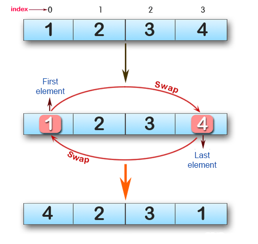
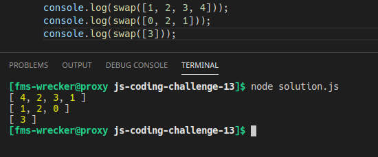

# js-coding-challenge-12

## Challenge:
Write a JavaScript program to swap the first and last elements of a given array of integers. The array length should be at least 1.
## Tips:
- Write your code in the ```solution.js``` file.
- Run/test your solution with node like this: ```node solution.js```, but make sure to open the terminal in the correct directory.

## Example:
### 1

### 2
