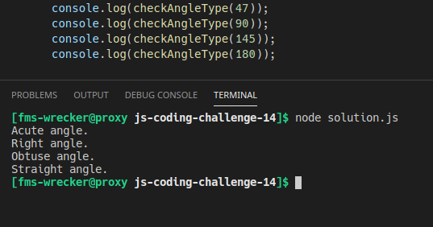

# js-coding-challenge-13

## Challenge:
Write a JavaScript program to find the types of a given angle.

Types of angles:
- Acute angle: An angle between 0 and 90 degrees.
- Right angle: An 90 degree angle.
- Obtuse angle: An angle between 90 and 180 degrees.
- Straight angle: A 180 degree angle.

**Try not to use an if/else statement.**
## Tips:
- Write your code in the ```solution.js``` file.
- Run/test your solution with node like this: ```node solution.js```, but make sure to open the terminal in the correct directory.

## Example:
