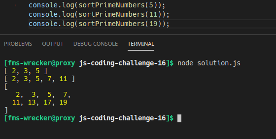

# js-coding-challenge-15

## Challenge:
Write a JavaScript program to sort an array of all prime numbers between 1 and a given integer.
## Tips:
- Write your code in the ```solution.js``` file.
- Run/test your solution with node like this: ```node solution.js```, but make sure to open the terminal in the correct directory.

## Example:
