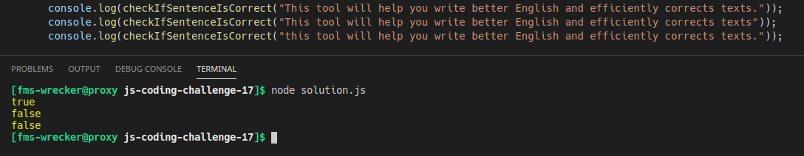

# js-coding-challenge-16

## Challenge:
Write a JavaScript program to check whether a given string represents a correct sentence or not. A string is considered correct sentence if it **starts with the capital letter** and **ends with a full stop (.)**.
## Tips:
- Write your code in the ```solution.js``` file.
- Run/test your solution with node like this: ```node solution.js```, but make sure to open the terminal in the correct directory.
- **Look up regular expressions.**

## Example:
