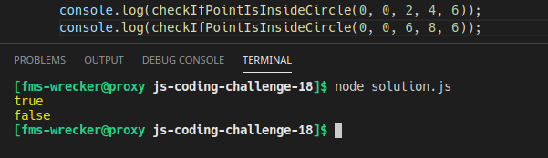
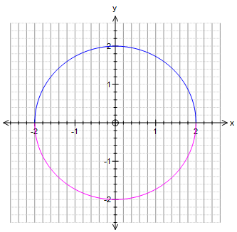

# js-coding-challenge-17

## Challenge:
Write a JavaScript program to check whether a point lies strictly inside a given circle.

Input:
- Point inside a circle (a, b)
- Center of the circle (x, y)
- Radius of circle: r
## Tips:
- Write your code in the ```solution.js``` file.
- Run/test your solution with node like this: ```node solution.js```, but make sure to open the terminal in the correct directory.
- **Look up the formula online.**

## Example:
### 1

### 2
