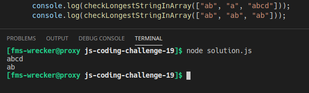

# js-coding-challenge-18

## Challenge:
Write a JavaScript program to find the longest string from a given array.
## Tips:
- Write your code in the ```solution.js``` file.
- Run/test your solution with node like this: ```node solution.js```, but make sure to open the terminal in the correct directory.

## Example:
