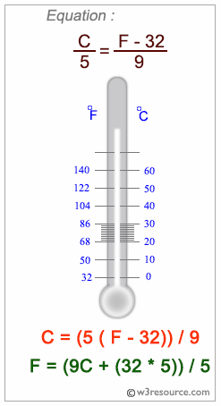
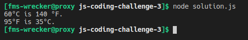

# js-coding-challenge-2
## Challenge:
Write a JavaScript program to convert temperatures to and from celsius, fahrenheit.

JavaScript: Fahrenheit and Centigrade Temperatures:

Fahrenheit and centigrade are two temperature scales in use today. The Fahrenheit scale was developed by the German physicist Daniel Gabriel Fahrenheit . In the Fahrenheit scale, water freezes at 32 degrees and boils at 212 degrees.

The centigrade scale, which is also called the Celsius scale, was developed by Swedish astronomer Andres Celsius. In the centigrade scale, water freezes at 0 degrees and boils at 100 degrees. The centigrade to Fahrenheit conversion formula is:

```C = (5/9) * (F - 32)```



## Tips:
- Write your code in the ```solution.js``` file.
- Run/test your solution with node like this: ```node solution.js```, but make sure to open the terminal in the correct directory.

## Example:
