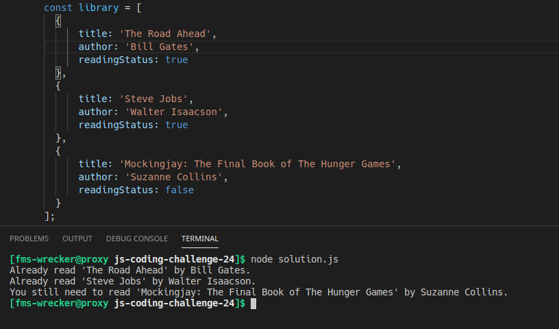

# js-coding-challenge-22

## Challenge:
Write a JavaScript program to display the reading status (i.e. display book name, author name and reading status) of the following books.
## Tips:
- Write your code in the ```solution.js``` file, under the sample object.
- Run/test your solution with node like this: ```node solution.js```, but make sure to open the terminal in the correct directory.

## Example:
